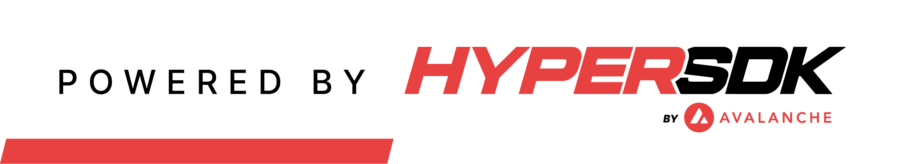

<<<<<<< HEAD
<<<<<<< HEAD
# AvalancheMod2
=======
<p align="center">
  
</p>
<p align="center">
  Mint, Transfer, and Trade User-Generated Tokens, All On-Chain
</p>
<p align="center">
  <a href="https://github.com/ava-labs/hypersdk/actions/workflows/tokenvm-static-analysis.yml"></a>
  <a href="https://github.com/ava-labs/hypersdk/actions/workflows/tokenvm-unit-tests.yml"></a>
  <a href="https://github.com/ava-labs/hypersdk/actions/workflows/tokenvm-sync-tests.yml"></a>
  <a href="https://github.com/ava-labs/hypersdk/actions/workflows/tokenvm-load-tests.yml"></a>
</p>
=======
>>>>>>> 1c1272c (Update README.md)

## DESCRIPTION: Avalanche HyperSDK
## Project: Create a Custom Subnet
Challenge: Your startup has identified a need to create a custom virtual machine to enable users to mint and transfer tokens. The HyperSDK provides a powerful solution for this task by allowing you to build a custom blockchain tailored to your specific needs. With the HyperSDK, you can define the rules and functionality of your chain, including the ability to create and transfer tokens and manage order books for trading assets.

## PRE INSTALLATION REQUIRED
1. WSL: I have made this project on Ubuntu using WSL.
2. GO: To install go , run
   ```
   sudo snap install go --classic
   ```
   Check if it is properly installed, run
   ```
   go version
   ```
 4. GCC: Install GCC in WSL:
    Open your WSL terminal and run the following commands:
    ```
    sudo apt update
    sudo apt install build-essential
    ```
    Verify the installation by running:
    ```
    gcc --version
    ```

## STEPS TO PERFORM
1. Clone this repository on ubuntu using
   ```
   git clone https://github.com/NirbehKaur/tokenvm/
   ```
2. Open this repository on VS code from ubuntu by running the following command
   ```
   code .
   ```
3. Now your repo is being opened in VS code. Install the necessary extensions being recommended by VS Code.
4. Open new Terminal, and run the following command to normalize all the dependencies:
  ```
  go mod tidy
  ```
5. Make sure Go is on your path, defined on your terminal, if not you can do so by running
   ```
   export PATH=$PATH:$(go env GOPATH)/bin
   ```
   If this path doesn’t work, you can also try ```export PATH=$PATH:/usr/local/go/bin```
7. Now open ubuntu and to launch your own `tokenvm` Subnet, run
  ``` MODE="run-single" ./scripts/run.sh ```(may take a few minutes)
8. Next, you'll need to build this. You can use the following command from this location
   to do so:
  ``` ./scripts/build.sh```

   _This command will put the compiled CLI in `./build/token-cli`._
9. Load the demo private key included on the project ```./build/token-cli key import demo.pk``` and ```./build/token-cli chain import-anr```
10. Interact with your own HyperChain
11. To close your Local Avalanche Network run ```killall avalanche-network-runner```

## Demonstration: Interacting with Hyperchain

#### Step 1: Create Your Asset
Lets create our own asset. You can do so by running the following command from this location:

./build/token-cli action create-asset

When you are done, the output should look something like this:
```
database: .token-cli
address: token1rvzhmceq997zntgvravfagsks6w0ryud3rylh4cdvayry0dl97nsjzf3yp
✔ metadata (can be changed later): ForgeChain█
continue (y/n): y
✅ txID: 2MuMFx41XP7C2j2FXkPnYD7nFWiDSgndQuei5crQm26nPchXR6
```

_`txID` is the `assetID` of your new asset._

The "loaded address" here is the address of the default private key (`demo.pk`). We
use this key to authenticate all interactions with the `tokenvm`.

#### Step 2: Mint Your Asset
After we've created our own asset, we can now mint some of it. You can do so by
running the following command from this location:
```
./build/token-cli action mint-asset
```

When you are done, the output should look something like this (usually easiest
just to mint to yourself).
```
database: .token-cli
address: token1rvzhmceq997zntgvravfagsks6w0ryud3rylh4cdvayry0dl97nsjzf3yp
chainID: bzBaxRGvBRaLiVjSouRMWLxfRG7ua5ZHDQwwiNQqaZEUoyV2W
assetID: 2MuMFx41XP7C2j2FXkPnYD7nFWiDSgndQuei5crQm26nPchXR6
metadata: ForgeChain supply: 0
✔ recipient: token1rvzhmceq997zntgvravfagsks6w0ryud3rylh4cdvayry0dl97nsjzrecipient: token1rvzhmceq997zntgvravfagsks6w0ryud3rylh4cdvayry0dl97nsjzf3yp
amount: 10000
continue (y/n): y
✅ txID: 2tCVJUafvxnwUES3MozaPGY5ZF1ZBFUM8e2EZ57LsrXApTvqr4
```

#### Step 3: View Your Balance
Now, let's check that the mint worked right by checking our balance. You can do
so by running the following command from this location:
```
./build/token-cli key balance
```

When you are done, the output should look something like this:
```
database: .token-cli
address: token1rvzhmceq997zntgvravfagsks6w0ryud3rylh4cdvayry0dl97nsjzf3yp
chainID: bzBaxRGvBRaLiVjSouRMWLxfRG7ua5ZHDQwwiNQqaZEUoyV2W
✔ assetID (use TKN for native token): 2MuMFx41XP7C2j2FXkPnYD7nFWiDSgndQue
uri: http://127.0.0.1:51387/ext/bc/bzBaxRGvBRaLiVjSouRMWLxfRG7ua5ZHDQwwiNQqaZEUoyV2W
metadata: ForgeChain supply: 10000 warp: false
balance: 10000 2MuMFx41XP7C2j2FXkPnYD7nFWiDSgndQuei5crQm26nPchXR6
```

#### Step 4: Transfer
After we've created our own asset, we can now transfer some of it. You can do so by
running the following command from this location:
```
./build/token-cli action transfer
```

When you are done, the output should look something like this 
```
database: .token-cli
address: token1rvzhmceq997zntgvravfagsks6w0ryud3rylh4cdvayry0dl97nsjzf3yp
chainID: bzBaxRGvBRaLiVjSouRMWLxfRG7ua5ZHDQwwiNQqaZEUoyV2W
✔ assetID (use TKN for native token): 2MuMFx41XP7C2j2FXkPnYD7nFWiDSgndQuei5crQm26nPchXR6
metadata: ForgeChain supply: 10000 warp: false
balance: 10000 2MuMFx41XP7C2j2FXkPnYD7nFWiDSgndQuei5crQm26nPchXR6
✔ recipient: token1rvzhmceq997zntgvravfagsks6w0ryud3rylh4cdvayry0dl97nsjz
yry0dl97nsjzf3yp█
amount: 900
continue (y/n): y
✅ txID: EZUP69nHVLSPfDQ7bDG1X6rbWYznbdTHSmsVm2byXsbXKq3ga
```

#### Step 5: Create an Order
So, we have some of our token (`ForgeCoin`)Let's put an order
on-chain that will allow someone to trade the native token (`TKN`) for some.
You can do so by running the following command from this location:
```
./build/token-cli action create-order
```

When you are done, the output should look something like this:
```
database: .token-cli
address: token1rvzhmceq997zntgvravfagsks6w0ryud3rylh4cdvayry0dl97nsjzf3yp
chainID: Em2pZtHr7rDCzii43an2bBi1M2mTFyLN33QP1Xfjy7BcWtaH9
in assetID (use TKN for native token): TKN
✔ in tick: 1█
out assetID (use TKN for native token): 27grFs9vE2YP9kwLM5hQJGLDvqEY9ii71zzdoRHNGC4Appavug
metadata: ForgeCoin supply: 10000 warp: false
balance: 10000 27grFs9vE2YP9kwLM5hQJGLDvqEY9ii71zzdoRHNGC4Appavug
out tick: 10
supply (must be multiple of out tick): 100
continue (y/n): y
✅ txID: 2TdeT2ZsQtJhbWJuhLZ3eexuCY4UP6W7q5ZiAHMYtVfSSp1ids
```

_`txID` is the `orderID` of your new order._

The "in tick" is how much of the "in assetID" that someone must trade to get
"out tick" of the "out assetID". Any fill of this order must send a multiple of
"in tick" to be considered valid (this avoid ANY sort of precision issues with
computing decimal rates on-chain).

#### Step 6: Fill Part of the Order
Now that we have an order on-chain, let's fill it! You can do so by running the
following command from this location:
```bash
./build/token-cli action fill-order
```

When you are done, the output should look something like this:
```
database: .token-cli
address: token1rvzhmceq997zntgvravfagsks6w0ryud3rylh4cdvayry0dl97nsjzf3yp
chainID: Em2pZtHr7rDCzii43an2bBi1M2mTFyLN33QP1Xfjy7BcWtaH9
in assetID (use TKN for native token): TKN
balance: 997.999993843 TKN
out assetID (use TKN for native token): 27grFs9vE2YP9kwLM5hQJGLDvqEY9ii71zzdoRHNGC4Appavug
metadata: ForgeCoin supply: 10000 warp: false
available orders: 1
0) Rate(in/out): 100000000.0000 InTick: 1.000000000 TKN OutTick: 10 27grFs9vE2YP9kwLM5hQJGLDvqEY9ii71zzdoRHNGC4Appavug Remaining: 100 27grFs9vE2YP9kwLM5hQJGLDvqEY9ii71zzdoRHNGC4Appavug
select order: 0
value (must be multiple of in tick): 2
in: 2.000000000 TKN out: 20 27grFs9vE2YP9kwLM5hQJGLDvqEY9ii71zzdoRHNGC4Appavug
continue (y/n): y
✅ txID: uw9YrZcs4QQTEBSR3guVnzQTFyKKm5QFGVTvuGyntSTrx3aGm
```

Note how all available orders for this pair are listed by the CLI (these come
from the in-memory order book maintained by the `tokenvm`).

#### Step 7: Close Order
Let's say we now changed our mind and no longer want to allow others to fill
our order. You can cancel it by running the following command from this
location:
```
./build/token-cli action close-order
```

When you are done, the output should look something like this:
```
order
database: .token-cli
address: token1rvzhmceq997zntgvravfagsks6w0ryud3rylh4cdvayry0dl97nsjzf3yp
chainID: bzBaxRGvBRaLiVjSouRMWLxfRG7ua5ZHDQwwiNQqaZEUoyV2W
orderID: YVA3n2ZTK3ZdJ6i2EMKzu8jyC3tFXqupGbbY7Y1bzDx8yZGUm
✔ out assetID (use TKN for native token): 2MuMFx41XP7C2j2FXkPnYD7nFWiDSgn
continue (y/n): y
✅ txID: t1GedwhYCujJvydQa8pS6mSKYuVKHSBt6HC6wZfzvNXAdVVwK
```

Any funds that were locked up in the order will be returned to the creator's
account.

### Step 8:   Watch Activity in Real-Time
To provide a better sense of what is actually happening on-chain, You can run this utility by running the following command from
this location:
```
./build/token-cli chain watch
```
## Acknowledgement

<<<<<<< HEAD
If you run it correctly, you'll see the following input (will run until the
network shuts down or you exit):
```
database: .token-cli
available chains: 2 excluded: []
0) chainID: Em2pZtHr7rDCzii43an2bBi1M2mTFyLN33QP1Xfjy7BcWtaH9
1) chainID: cKVefMmNPSKmLoshR15Fzxmx52Y5yUSPqWiJsNFUg1WgNQVMX
select chainID: 0
watching for new blocks on Em2pZtHr7rDCzii43an2bBi1M2mTFyLN33QP1Xfjy7BcWtaH9 👀
height:13 txs:1 units:488 root:2po1n8rqdpNuwpMGndqC2hjt6Xa3cUDsjEpm7D6u9kJRFEPmdL avg TPS:0.026082
✅ 2Qb172jGBtjTTLhrzYD8ZLatjg6FFmbiFSP6CBq2Xy4aBV2WxL actor: token1rvzhmceq997zntgvravfagsks6w0ryud3rylh4cdvayry0dl97nsjzf3yp units: 488 summary (*actions.CreateOrder): [1.000000000 TKN -> 10 27grFs9vE2YP9kwLM5hQJGLDvqEY9ii71zzdoRHNGC4Appavug (supply: 50 27grFs9vE2YP9kwLM5hQJGLDvqEY9ii71zzdoRHNGC4Appavug)]
height:14 txs:1 units:1536 root:2vqraWhyd98zVk2ALMmbHPApXjjvHpxh4K4u1QhSb6i3w4VZxM avg TPS:0.030317
✅ 2H7wiE5MyM4JfRgoXPVP1GkrrhoSXL25iDPJ1wEiWRXkEL1CWz actor: token1rvzhmceq997zntgvravfagsks6w0ryud3rylh4cdvayry0dl97nsjzf3yp units: 1536 summary (*actions.FillOrder): [2.000000000 TKN -> 20 27grFs9vE2YP9kwLM5hQJGLDvqEY9ii71zzdoRHNGC4Appavug (remaining: 30 27grFs9vE2YP9kwLM5hQJGLDvqEY9ii71zzdoRHNGC4Appavug)]
height:15 txs:1 units:464 root:u2FyTtup4gwPfEFybMNTgL2svvSnajfGH4QKqiJ9vpZBSvx7q avg TPS:0.036967
✅ Lsad3MZ8i5V5hrGcRxXsghV5G1o1a9XStHY3bYmg7ha7W511e actor: token1rvzhmceq997zntgvravfagsks6w0ryud3rylh4cdvayry0dl97nsjzf3yp units: 464 summary (*actions.CloseOrder): [orderID: 2Qb172jGBtjTTLhrzYD8ZLatjg6FFmbiFSP6CBq2Xy4aBV2WxL]
```

### Transfer Assets to Another Subnet
Unlike the mint and trade demo, the AWM demo only requires running a single
command. You can kick off a transfer between the 2 Subnets you created by
running the following command from this location:
```bash
./build/token-cli action export
```

When you are done, the output should look something like this:
```
database: .token-cli
address: token1rvzhmceq997zntgvravfagsks6w0ryud3rylh4cdvayry0dl97nsjzf3yp
chainID: Em2pZtHr7rDCzii43an2bBi1M2mTFyLN33QP1Xfjy7BcWtaH9
✔ assetID (use TKN for native token): TKN
balance: 997.999988891 TKN
recipient: token1rvzhmceq997zntgvravfagsks6w0ryud3rylh4cdvayry0dl97nsjzf3yp
amount: 10
reward: 0
available chains: 1 excluded: [Em2pZtHr7rDCzii43an2bBi1M2mTFyLN33QP1Xfjy7BcWtaH9]
0) chainID: cKVefMmNPSKmLoshR15Fzxmx52Y5yUSPqWiJsNFUg1WgNQVMX
destination: 0
swap on import (y/n): n
continue (y/n): y
✅ txID: 24Y2zR2qEQZSmyaG1BCqpZZaWMDVDtimGDYFsEkpCcWYH4dUfJ
perform import on destination (y/n): y
22u9zvTa8cRX7nork3koubETsKDn43ydaVEZZWMGcTDerucq4b to: token1rvzhmceq997zntgvravfagsks6w0ryud3rylh4cdvayry0dl97nsjzf3yp source assetID: TKN output assetID: 2rST7KDPjRvDxypr6Q4SwfAwdApLwKXuukrSc42jA3dQDgo7jx value: 10000000000 reward: 10000000000 return: false
✔ switch default chain to destination (y/n): y
```

_The `export` command will automatically run the `import` command on the
destination. If you wish to import the AWM message using a separate account,
you can run the `import` command after changing your key._

### Running a Load Test
_Before running this demo, make sure to stop the network you started using
`killall avalanche-network-runner`._

The `tokenvm` load test will provision 5 `tokenvms` and process 500k transfers
on each between 10k different accounts.

```bash
./scripts/tests.load.sh
```

_This test SOLELY tests the speed of the `tokenvm`. It does not include any
network delay or consensus overhead. It just tests the underlying performance
of the `hypersdk` and the storage engine used (in this case MerkleDB on top of
Pebble)._

#### Measuring Disk Speed
This test is extremely sensitive to disk performance. When reporting any TPS
results, please include the output of:

```bash
./scripts/tests.disk.sh
```

_Run this test RARELY. It writes/reads many GBs from your disk and can fry an
SSD if you run it too often. We run this in CI to standardize the result of all
load tests._

## Zipkin Tracing
To trace the performance of `tokenvm` during load testing, we use `OpenTelemetry + Zipkin`.

To get started, startup the `Zipkin` backend and `ElasticSearch` database (inside `hypersdk/trace`):
```bash
docker-compose -f trace/zipkin.yml up
```
Once `Zipkin` is running, you can visit it at `http://localhost:9411`.

Next, startup the load tester (it will automatically send traces to `Zipkin`):
```bash
TRACE=true ./scripts/tests.load.sh
```

When you are done, you can tear everything down by running the following
command:
```bash
docker-compose -f trace/zipkin.yml down
```

## Deploying to a Devnet
_In the world of Avalanche, we refer to short-lived, test Subnets as Devnets._

To programaticaly deploy `tokenvm` to a distributed cluster of nodes running on
your own custom network or on Fuji, check out this [doc](DEVNETS.md).

## Future Work
_If you want to take the lead on any of these items, please
[start a discussion](https://github.com/ava-labs/hypersdk/discussions) or reach
out on the Avalanche Discord._

* Add more config options for determining which order books to store in-memory
* Add option to CLI to fill up to some amount of an asset as long as it is
  under some exchange rate (trading agent command to provide better UX)
* Add expiring order support (can't fill an order after some point in time but
  still need to explicitly close it to get your funds back -> async cleanup is
  not a good idea)
* Add lockup fee for creating a Warp Message and ability to reclaim the lockup
  with a refund action (this will allow for "user-driven" acks on
  messages, which will remain signable and in state until a refund action is
  issued)

<br>
<br>
<br>
<p align="center">
  <a href="https://github.com/ava-labs/hypersdk"></a>
</p>
>>>>>>> 7ee8db2 (Add files via upload)
=======
This project was forked from the original [TokenVM](https://github.com/Metacrafters/tokenvm.git) . I acknowledge and thank Metacrafters team for their work and contributions to the blockchain community.
>>>>>>> 1c1272c (Update README.md)
